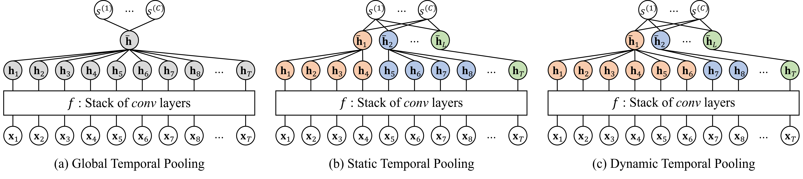

# Learnable Dynamic Temporal Pooling for Time Series Classification

- This is the author code of ["Learnable Dynamic Temporal Pooling for Time Series Classification"](https://arxiv.org/abs/2104.02577) (AAAI 2021).
- We employ (and customize) the fast CUDA implementation of soft-dtw (based on pytorch), publicly available at https://github.com/Maghoumi/pytorch-softdtw-cuda.
- For more details of soft-dtw, please refer to [the original paper](https://dl.acm.org/doi/10.5555/3305381.3305474) and the repository above.

## Overview

<p align="center">

</p>

The global pooling layer (i.e., global average/max pooling) that has been mainly adopted by existing CNN classifiers simply aggregates all hidden vectors, whereas our **dynamic temporal pooling (DTP)** layer effectively reduces the temporal size based on semantic segmentation.
A CNN classifier with the DTP layer utilizes the **segment-level representation** and **segment-level fully-connected layer** for its classification, which allows to extract further class-discriminative features and improves the classification accruacy.

## Running the codes

### STEP 1. Install the following python libraries / packages

- numpy
- numba
- sktime
- pytorch


### STEP 2. Download the benchmark datasets for time series classification

- We provide a small univariate time series dataset, [`GunPoint`](http://www.timeseriesclassification.com/description.php?Dataset=GunPoint), as default.
- The datatsets can be downloaded from the UCR/UEA repository: http://www.timeseriesclassification.com.
- Place `DATASET_TRAIN.ts` and `DATASET_TEST.ts` files in `./data/Univariate/DATASET` or `./data/Multivariate/DATASET`.


### STEP 3. Train the CNN classifier with the DTP layer

You can simply run the code by the following command.
```
python train_classifier.py
```

You can further specify the details of the classifier and its optimization by input arguments.
```
python train_classifier.py --dataset GunPoint --model fcn --pooling_op max --n_segments 4 --gamma 1.0
```

## Citation
```
@inproceedings{lee2021learnable,
  title={Learnable Dynamic Temporal Pooling for Time Series Classification},
  author={Lee, Dongha and Lee, Seonghyeon and Yu, Hwanjo},
  booktitle={Proceedings of the AAAI Conference on Artificial Intelligence},
  volume={35},
  number={9},
  pages={8288--8296},
  year={2021}
}
```
